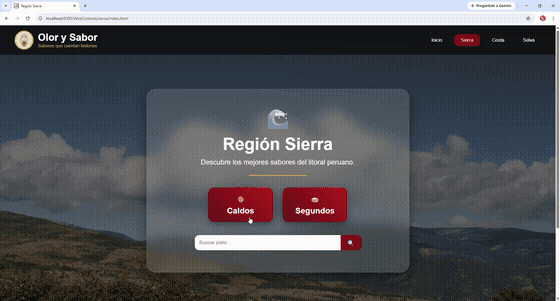
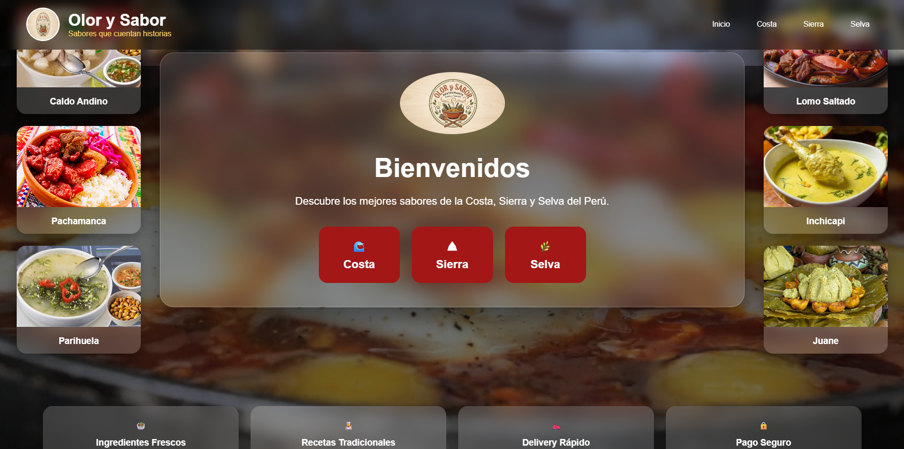
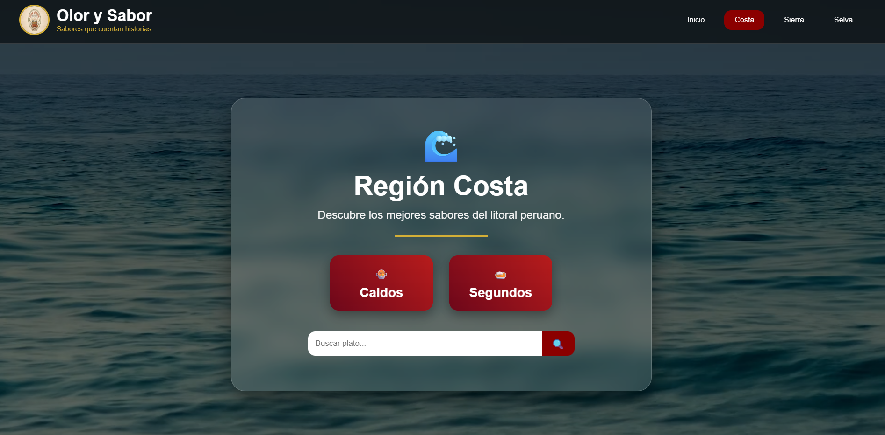
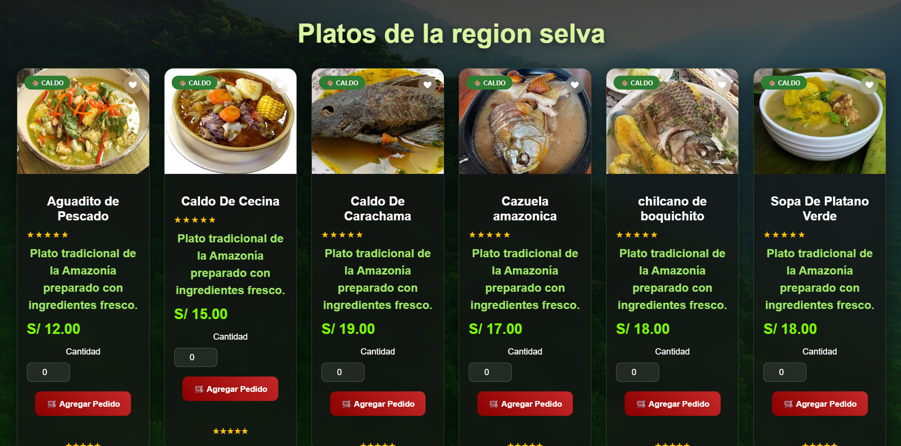
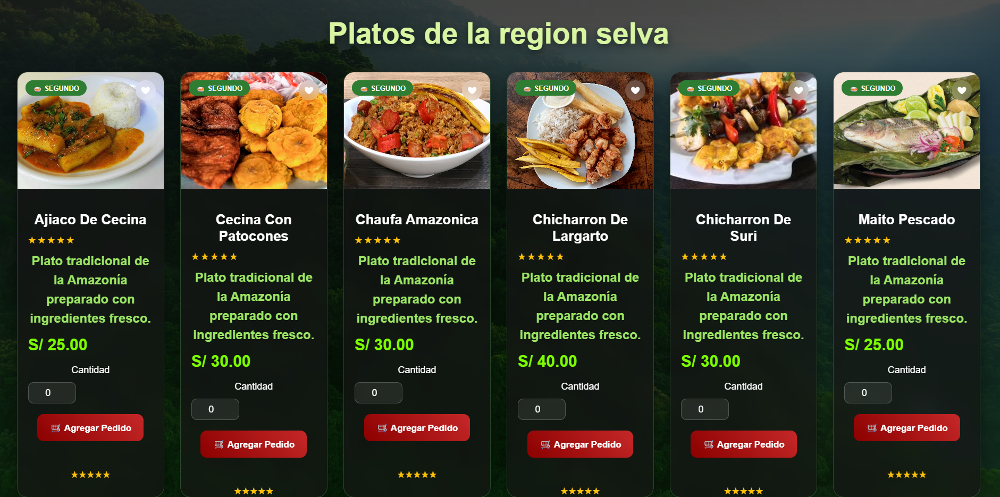
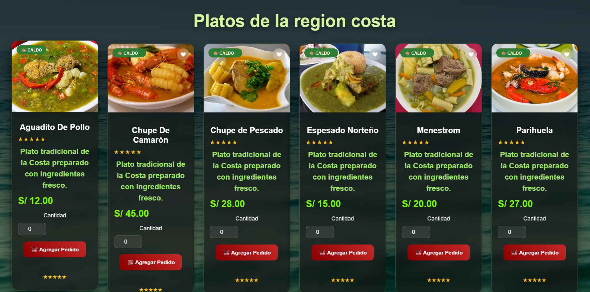
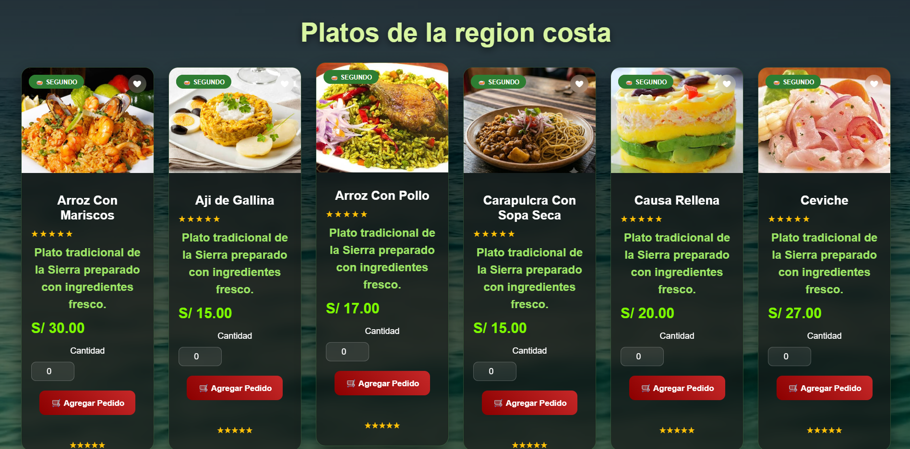
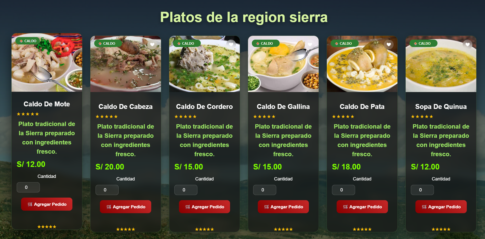
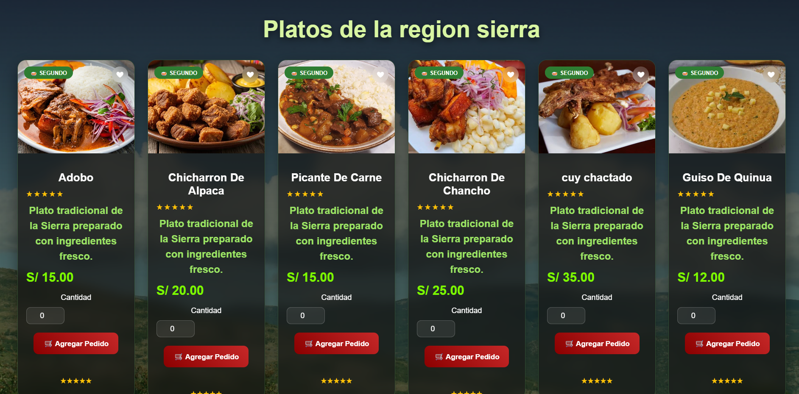

# 🍲 Olor y Sabor

Aplicación web de pedidos de comida peruana, organizada por regiones (Costa, Sierra, Selva). Proyecto full-stack construido con **Java Servlets + JDBC** en el backend y **HTML/CSS/JavaScript** en el frontend, con persistencia en **MySQL**.



## ✨ Funcionalidades

- Catálogo de platos por región y categoría (Caldos / Segundos)
- Buscador de platos en tiempo real
- Carrito de compras con `localStorage`
- Registro de cliente y pedido en base de datos
- Flujo de pago simulado (Tarjeta, Yape/Plin, Efectivo) con registro en BD
- Diseño responsive con tema visual rojo/vino inspirado en la gastronomía peruana

## 🛠️ Tecnologías

- **Backend:** Java (Jakarta Servlets), JDBC
- **Base de datos:** MySQL
- **Frontend:** HTML5, CSS3, JavaScript (vanilla)
- **Servidor:** Apache Tomcat 10.x

## 📁 Estructura del proyecto

```
olor-y-sabor/
├── src/backend/
│   ├── controladores/    # Servlets (ClienteServlet, PagoServlet, PedidoController)
│   ├── DAO/               # Acceso a datos (ClienteDAO, PedidoDAO, PagoDAO, ...)
│   ├── modelos/           # Clases modelo (Cliente, Pedido, Pago, ...)
│   └── conexion/          # Conexión a MySQL
├── WebContent/
│   ├── costa/ sierra/ selva/   # Páginas por región
│   ├── css/ js/ imagenes/ videos/
│   └── Cliente.html  pagos.html  index.html
└── dateBase/
    ├── 01_crear_base.sql
    ├── 02_datos_iniciales.sql
    └── 04_crear_tabla_pagos.sql
```

## 🚀 Cómo correrlo localmente

### Requisitos
- JDK 17 o superior
- Apache Tomcat 10.x
- MySQL 8.x

### Pasos

1. Clona el repositorio
   ```bash
   git clone https://github.com/tu-usuario/olor-y-sabor.git
   ```

2. Crea la base de datos ejecutando en orden en MySQL Workbench:
   ```
   dateBase/01_crear_base.sql
   dateBase/02_datos_iniciales.sql
   dateBase/04_crear_tabla_pagos.sql
   ```

3. Configura las variables de entorno para la conexión a la base de datos:
   ```
   DB_URL=jdbc:mysql://localhost:3306/olor_sabor
   DB_USER=tu_usuario
   DB_PASSWORD=tu_contraseña
   ```

4. Compila el backend:
   ```bash
   javac -d "WebContent/WEB-INF/classes" -cp "WebContent/WEB-INF/lib/*;<ruta_a_tomcat>/lib/*" $(find src -name "*.java")
   ```

5. Despliega la carpeta `WebContent` en Tomcat y accede a `http://localhost:8080/`

## 🌐 Demo en vivo

👉 [Ver demo](#) *(link pendiente)*

## 📸 Capturas

| Inicio | Región Costa |
|---|---|
|  |  |

| Catálogo (Selva) | Catálogo (Selva, cont.) |
|---|---|
|  |  |
|  |  |
|  |  |

## 👤 Autor

Proyecto desarrollado por willian torres amiquero como parte de portafolio.